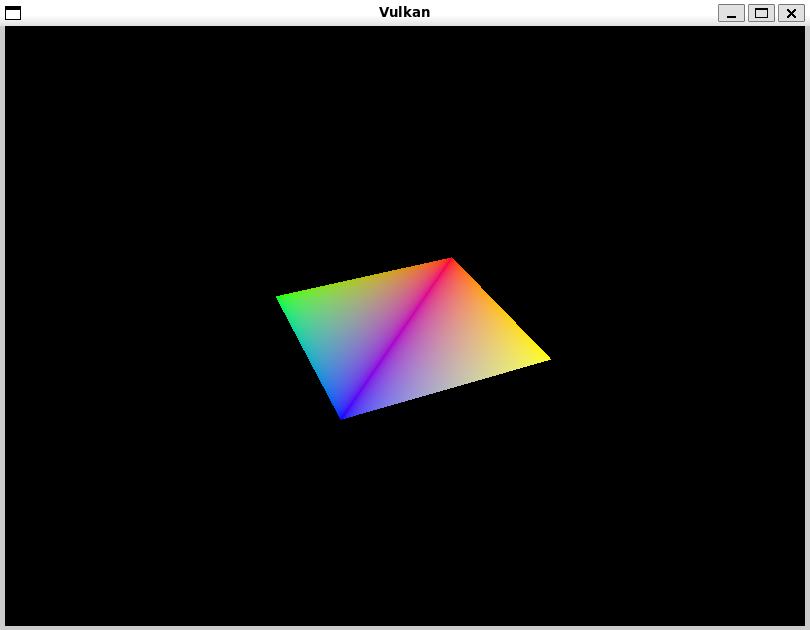

# MyProject

A minimal CMake C++ project scaffold.


## Build (PowerShell)

```powershell
# Create an out-of-source build directory
md build; cd build

# Configure (multi-config generators like Visual Studio can omit -DCMAKE_BUILD_TYPE)
cmake .. -DCMAKE_BUILD_TYPE=Release

# Build
cmake --build . --config Release

# Run (Windows)
.
# On Windows: .\Release\myapp.exe  (if using multi-config)
# Or if using single-config generators:
# .\myapp.exe
```

## Notes
- Requires CMake 3.15 or newer.
- Uses C++17.

